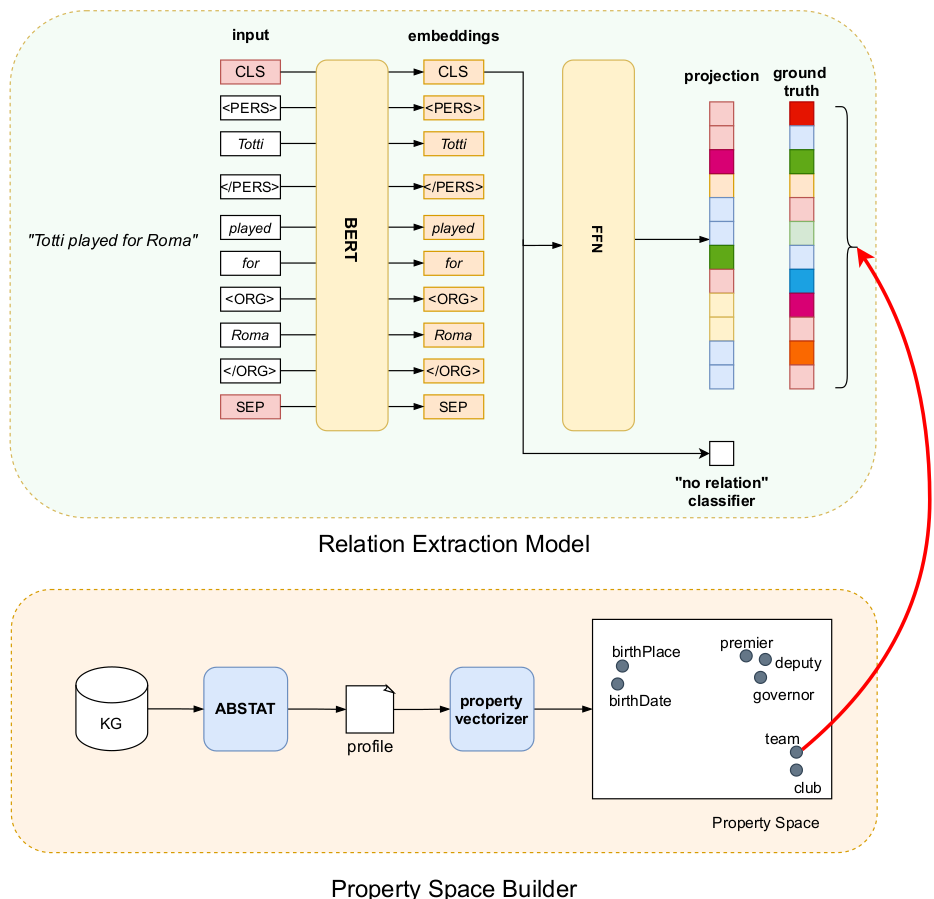

# ABSTAT4RE: Relation Extraction by Exploiting Comprehensive Knowledge Graph Profiles

## Overview
ABSTAT4RE is a relation extraction (RE) model that integrates knowledge from pre-trained language models with structured knowledge from Knowledge Graph (KG) profiles. By leveraging ABSTAT profiles, the model enhances RE tasks by injecting property information extracted from the KG, leading to improved relation classification.




## Features
- **Multitask Learning Architecture**: Simultaneously classifies relations and projects sentences into a structured property space.
- **Integration with ABSTAT Profiles**: Uses KG patterns and statistics to inform relation extraction.
- **Pre-trained Transformer Model**: DistilBERT with adapter layers for efficient learning.
- **Custom Property Space**: Constructs interpretable vector representations of KG properties.
- **Support for No-Relation Classification**: Reduces noise by treating "no relation" separately.


## Model Architecture
- **Input Processing**: Tokenizes sentences and marks entity mentions.
- **BERT Encoder**: Generates contextual embeddings.
- **Dual-Branch Learning**:
  - **Classification Branch**: Identifies whether a relation exists.
  - **Projection Branch**: Maps sentence embeddings to a structured property space.
- **Loss Function**: Combined Binary Cross Entropy (BCE) and Cosine Embedding Loss for multitask optimization.

## Dataset
The model is trained and evaluated on the KBP37 dataset, a widely used relation extraction benchmark. The Knowledge Graph used for profiling is **DBpedia 2016-10**.

## Usage
### 1. Prepare Data
Ensure the dataset and property space are properly set up:
```bash
mkdir -p data/profiles data/datasets data/outputs/prop_spaces data/outputs/datasets metadata
```

### 2. Run the Evaluation Pipeline
Execute the main pipeline:
```bash
python pipeline.py
```
This will:
1. Load or create the dataset.
2. Process and store the property space.
3. Prepare data for training (vectorized labels, tokenization, and DataLoader creation).
4. Train and evaluate the models (Baseline Classifier & ABSTAT4RE).
5. Test the trained models.


## Results
| Model       | Macro F1 | Weighted F1 |
|------------|---------|------------|
| Baseline (BERT) | 0.43    | 0.50       |
| **ABSTAT4RE** | **0.66**  | **0.64**   |

ABSTAT4RE significantly outperforms the baseline, particularly in distinguishing semantically similar relations and handling "no relation" cases.

## Future Work
- Extend evaluation to datasets like **FewRel**.
- Improve type injection using KG entity linking.
- Explore additional KG statistics for property space enhancement.
